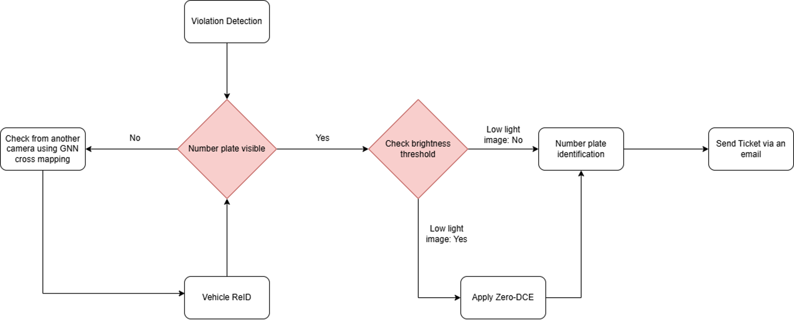
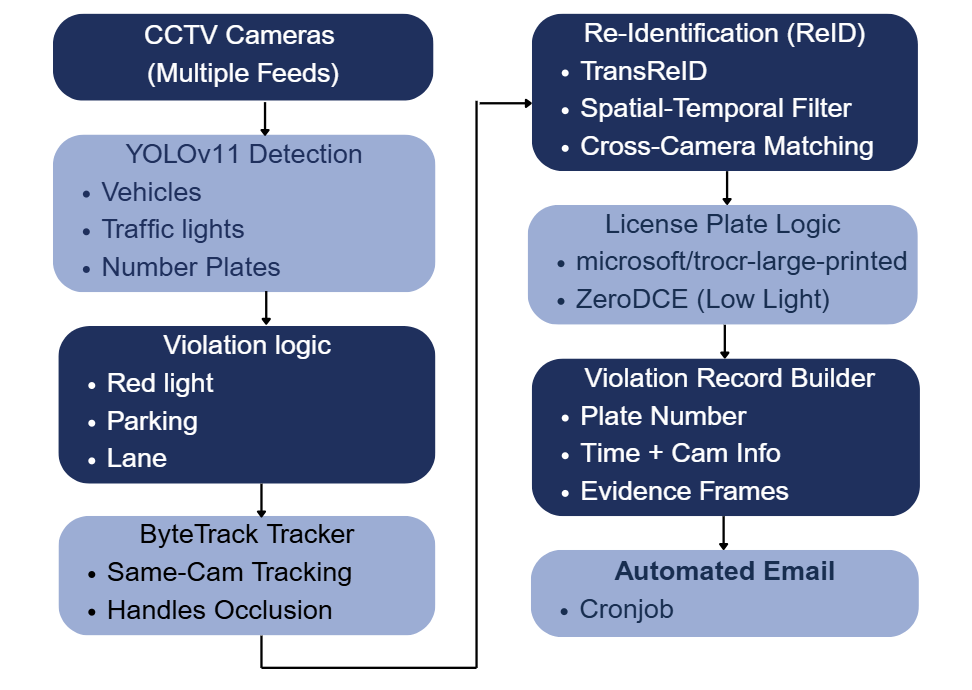
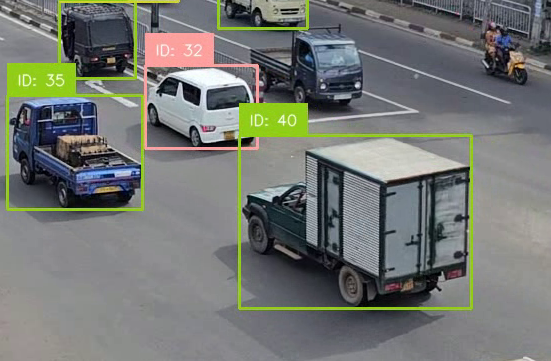
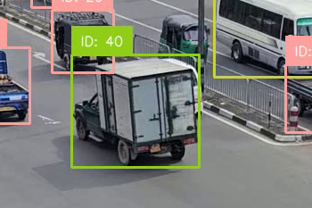
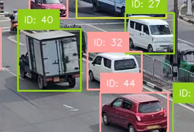
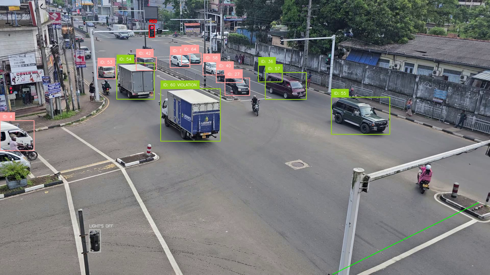
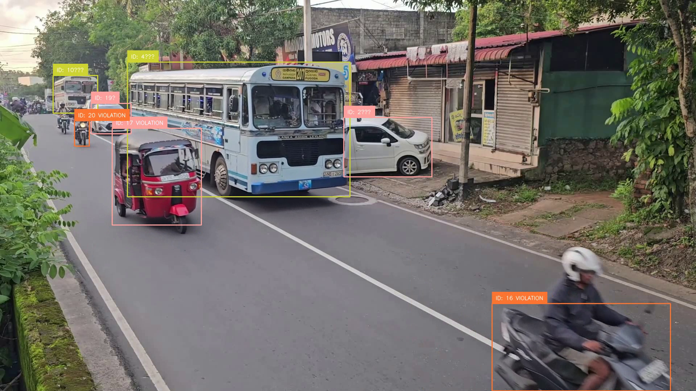
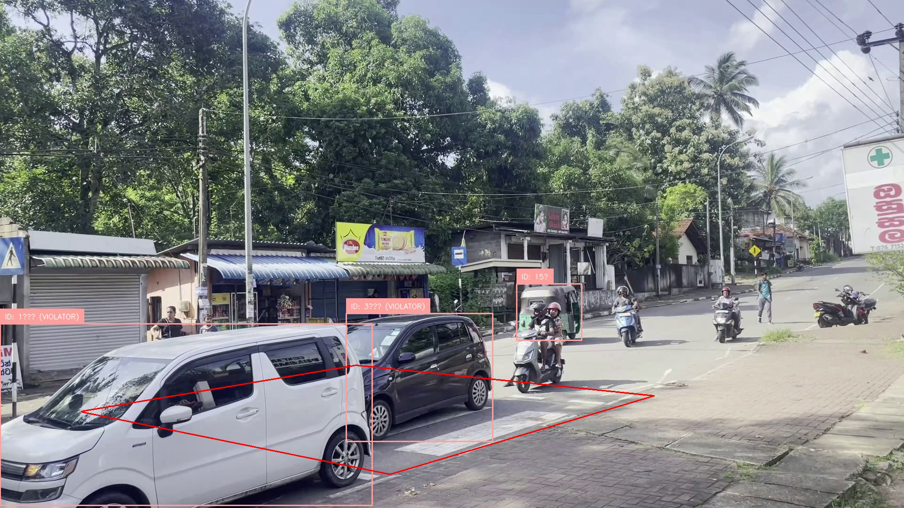

# Occluwatch 🚦📷  
**A Multi-Camera Vehicle Tracking & Violation Detection in Highly Congested Areas with Occlusion Handling and Vehicle Re-identification**

---

## 📌 Overview
**Occluwatch** is our Final Year Project for the **BSc (Hons) in Computer Engineering** at the University of Sri Jayewardenepura.  
It is an **AI-powered multi-camera traffic surveillance system** designed for **highly congested urban areas** where vehicle **occlusion**, **identity switches**, and **complex camera layouts** make traffic monitoring challenging.

Occluwatch can:
- **Handle occlusions** and **re‑identify** vehicles across cameras
- **Track** vehicles in real time
- Detect **traffic violations**:
  - 🚦 **Red-light running**
  - ↔ **Illegal lane changes / line crossing**
  - ⛔ **Illegal parking**
- **Recover license plates** even under poor visibility
- **Automatically issue violation tickets** via email through an integrated web portal

---

## 🎯 Objectives
- **Occlusion handling** – Maintain continuous tracking despite vehicles being hidden by other vehicles or objects.
- **Vehicle re‑identification** – Match the same vehicle across multiple CCTV cameras.
- **Violation detection** – Identify red-light, lane, and parking violations automatically.
- **Automated ticketing** – Send violation notices to drivers via email, with attached evidence.
- **Real‑time operation** – Achieve near real-time processing on standard GPU hardware.

---

## 🛠 Flow Diagram

  
*High-level architecture of Occluwatch integrating detection, tracking, re-identification, OCR, and ticketing.*

---

## 🛠 Model Pipeline Overview

  

---

## 🧠 Key Modules

### 1. **Detection**
- **YOLOv11s** fine-tuned on a **Sri Lankan custom dataset** for:
  - Vehicles (cars, motorcycles, trucks, buses, three-wheelers)
  - Traffic lights (red/yellow/green)
  - License plates
- Optimized for **speed/accuracy** trade-off (≈50 FPS for detection).

### 2. **Violation Logic**
- 🚦 **Red-light** – Detects vehicles crossing the stop line during a red signal.  
- ↔ **Lane** – Detects illegal crossing of solid/double lines.  
- ⛔ **Parking** – Flags vehicles stopped in restricted areas for >3s.

### 3. **Tracking**
- **ByteTrack** for robust **multi-object tracking**.
- Recovers tracks through **occlusions** using both high- and low-confidence detections.

### 4. **License Plate Recognition**
- Cropping, preprocessing (grayscale, histogram equalization, Gaussian blur, sharpening).
- **Zero-DCE** for low-light enhancement.
- **Microsoft TrOCR** for OCR.
- Sri Lankan plate pattern validation.

### 5. **Cross-Camera Re‑Identification**
- **TransReID** (Transformer-based) for vehicle appearance features.
- **GCN** (Graph Convolutional Network) for **spatio-temporal camera handoff**.

### 6. **Automated Reporting**
- CSV logging with violation metadata.
- Email ticket generation via **Nodemailer**.
- Manual verification for ID/plate ambiguities.

---

## 🎥 Demo Video

[▶ **Watch Demo Video**](https://drive.google.com/file/d/1JyhW-yE2u9EEv0VNg4OAo105jIEy_ajq/view?usp=drive_lin)

---

## 🎥 Example Occlusion Handling Results

| Before Occlusion | During Occlusion | After Occlusion |
|---------------------|----------------|-------------------|
|  |  |  |

---

## 🎥 Example Violation Detection Results

| Red Light Violation | Lane Violation | Parking Violation |
|---------------------|----------------|-------------------|
|  |  |  |

---

## 📊 Performance
| Component                  | Model       | Accuracy (%) | FPS |
|---------------------------|-------------|--------------|-----|
| Vehicle Detection          | YOLOv11s    | mAP ≈ 78     | 50* |
| Vehicle Re‑ID              | FastReID    | 81.9–82.9    | 12  |
| Vehicle Re‑ID              | **TransReID** | **82.3–85.2**| 11  |
| Full Pipeline (TransReID)  | —           | 80.4         | 11  |

\* Detection-only performance; full pipeline runs at ≈11 FPS.

---

## 💻 Hardware Requirements

* GPU: NVIDIA RTX 2070 (8GB VRAM) or higher recommended
* RAM: ≥16 GB
* CPU: Intel i7 or equivalent
* OS: Linux / Windows 10+

---

## 👨‍💻 Authors

* S.D.A.Y.D. Dissanayake – Vehicle Re‑ID, Occlusion Handling, System Integration
* W.N.R. Fernando – Cross-Camera Mapping (GCN), Violation Detection
* K.S. Waththegama – Web Application, License Plate Recognition
* Supervisors – Dr. Randima Dinalankara, Mr. Lakshan Madhushanka

---

## 📬 Contact

For inquiries, please contact:

📧 y.dissanayake.yd@gmail.com | 📧 nirufernando03@gmail.com | 📧 waththegamaks@gmail.com

